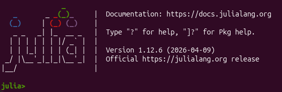
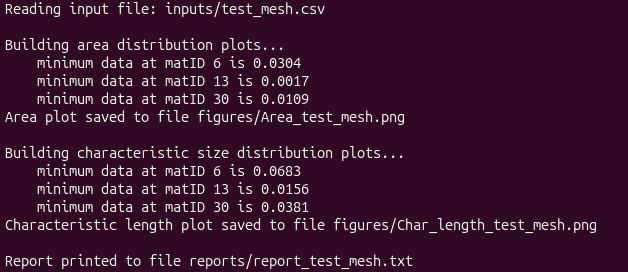

# Julia_tools_for_pre_post_BASEMENT_simulation_analisys

This tool was developed by Amedeo Repele. For any bugs in the code or requests for information, please send a message to _amedeo.repele@unitn.it_. It is assumed here the functionalities and the functioning of BASEMENT [(website)](https://basement.ethz.ch/) are known. The tools reported here are ment to provide additional (useful) tools to the BASEMENT users, partially including some python script developed by ETH [BASEtools](https://basement.ethz.ch/download/tools/python-scripts.html).

List of requirements and performance/utilization tips [here](https://github.com/AmeGit01/Julia_tools_for_pre_post_BASEMENT_simulation_analisys/blob/main/docs/requirements_tips.md)

The repository contains the julia (and python) scripts for doing the following:  

1. PRE: Computing statistical quantities for BASEMENT mesh, in order to help analyzing the mesh prior to setting up any simulation (mesh_stats.jl);
2. POST: Extracting and plotting the discharge (many other quantities are available in principle, so fare only discharge is considered) time series for any nodestring defined within the mesh and the model.json file;
3. POST: Finding which cell is determining the time step size of the simulation, for each frame saved on the results.h5 file.

## Folder structure initialization
One of the python script (Julia_tools_initializer.py) is devoted to initialize the working tree as first time. Once you have cloned this repository (or downloaded in any way) then locate to the folder in which you want to analyze the results and run the python script using:
````
cd path/to/results/folder
python path/to/Julia_tools_initializer.py
````

The script is initializing the folders and copying into them the python and julia scripts, which are upgraded to the same version you have downloaded the repository. This script require a local version of the repository, or at least a local version of the script to be copied into.  
The script already contain a default path, but also ask you if it is correct. By opening the script the default path can be modified of course (line 9).

# 1. PRE: mesh_stats.jl
## Description
### Arguments

The Julia script or the app equivalently require the following arguments:

1. ``input_file.csv``: this file contains the mesh information and must include the following columns:
	1.	fid: cell id within the mesh
	2.	matid: material id of the cell
	3.	area: area of the cell
	4.	min_len: minimum length of each cell (CFL reference length for BASEMD)
	5.	ins_rad: radius of the inscribed circle for each mesh (CFL reference length for BASEHPC)

    The order of the columns is not importat, but the name do! Other additional columns can be present with any name, it will not be a problem. The only restriction is that the five columns above have the correct name.  
	Colums can be obtained using QGIS, for a complete tutorial on how to get them see [Getting_fields_QGIS_tutotial](https://github.com/AmeGit01/Statistic_tool_for_BASEMENT_mesh/blob/main/docs/tutorial_getting_fields.md).

2. ``MatIDfile.txt``: this file contains the list of the material IDs (matIDs) for which the user wants to plot statistics. It also allows the user to specify whether a logarithmic (base 10) scale should be used for the vertical axis of each subplot to improve the visualization of the Area and Characteristic Size distributions;

3. ``BASEflow``: this argument specifies which BASEMENT model the user is using. Accepted values are ``BASEMD`` and ``BASEHPC``. If the mesh does not originate from the BASEMENT environment, select the option that matches the CFL condition described in the reference manual of the model of interest, or simply choose the most appropriate one according to the definitions given above.

4.  ``FigureFormat``: this allows the user to specify the format of the output figures. Accepted values are ``png``, ``jpg``, ``pdf``, and ``svg``. Do **not** include the dot. For example, ``pdf`` is correct, while ``.pdf`` is not;

### Outputs

The tool produces three output files: two graphical outputs and one quantitative report.

1. Area_input_file.FigureFormat: this plot shows the distribution of cell areas for each material ID selected in ``MatIDfile.txt``. The vertical lines represent the quantile values [0.1%, 1%, 5%, 10%], which are the default settings. These values can be customized within the script.

2. Char_length_input_file.FigureFormat: this is analogous to the previous plot, but it considers the characteristic length used by the CFL condition. The same quantiles are displayed.

3. Report_input_file.txt: this report provides, for both datasets and for each material ID, the number of cells below each quantile together with their cell IDs. This allows the user to easily identify the smallest cells and the potential computational bottlenecks.

## Running the tool

Read **Optional** first ([here](httos://github.com/AmeGit01/Julia_tools_for_pre_post_BASEMENT_simulation_analisys/blob/main/docs/requirements_tips.md)).

To run the ``mesh_stats.jl`` script, open a terminal, navigate to the repository using the ``cd`` command, and then proceed as follows.

#### First run (or whenever Julia indicates it is needed)

Start a Julia REPL by typing:

````
julia
````

The REPL has the following layout:



Then enter package mode by pressing the ``]`` key and run:
````
instantiate
````

or equivalently:

````
using Pkg
Pkg.instantiate()
````


A ``Manifest.toml`` file should now be created in the project folder. This file is generated from the ``Project.toml`` file, which is already included in the repository.  

In case the command ````instantiate```` is not running, try:

````
update
```` 
or equivalently:

````
using Pkg
Pkg.update()
````

first, and then ````instantiate````.

You can now follow the instructions below.

#### From the second run onward

Run the following command from the terminal:
````
julia src/mesh_stats.jl input_file.csv MatIDfile.txt BASEflow FigureFormat 
````

Remember to replace the arguments with the appropriate values.

***Example***  
This example is already included in the repository.

Run the following command:
````
julia src/mesh_stats.jl inputs/test_mesh.csv inputs/test_regions.txt BASEHPC png
````

If everything has been set up correctly, the terminal should display the following:




# 2. POST: plot_all.jl, custom_plot.jl, BMvxxNodestringResults.py

The steps to use this tool are simple, the scripts to be used are 4 in total, and they are:

1. BMv41NodestringResults.py: Python script developed by ETH for extracting the nodestring data to csv (BASEMENT version 4.1);
2. BMv42NodestringResults.py: Python script developed by ETH for extracting the nodestring data to csv (BASEMENT version 4.2);

Use just one of the two, depending on you BASEMENT version. Also the script for BASEMENT version 4.0 is available online at [BASEtools](https://basement.ethz.ch/download/tools/python-scripts.html), in case you need it, pay attention to the inputs/outputs paths.   
Both this scripts automatically look for file which end with "results.h5" within the "inputs/" folder. It is recommended to extract one file at a time, otherwise only the first file found will be extracted.  
Run both this file typing:

````
python py_src/BMv41NodestringResults.py
````
````
python py_src/BMv42NodestringResults.py
````

3. Plot_all.jl: julis script which plot all the node strings, at the execution time, it can be chose to plot all the nodestrings in one graph or to produce a separated file each. Output format is pdf for clearer view, the scripts automatically detect any file which end with "discharge.csv" within the "outputs/" folder.  
Run the file by typing:

````
julia src/plot_all.jl
````

In case something go wrong, refer to the "first run" section above.

4. Custom_plot.jl: Same phylosofy of the previous script, but also allow to plot only some of the nodestring, as you prefer. Is is more flexible, but also slower to be used. Run it using:

````
julia src/custom_plot.jl
````

# 3. POST: find_dt.jl
This julia script allow to find exactly which cell is limiting the time step size of a BASEMENT simulation. Since the time step size depends on water depth and water velocity, in addition to the radius of the inscribed circle (BASEHPC), the limiting cell cannot be determined a priori. The script is also producing a report of the 20 cells with present the smallest time step size. The input file i referred to a single frame in time, possible improvements could allow to input a file with all the available times on and than an unique report for the whole simulation will be produced. Run the script using:

````
julia src/find_dt.jl
````